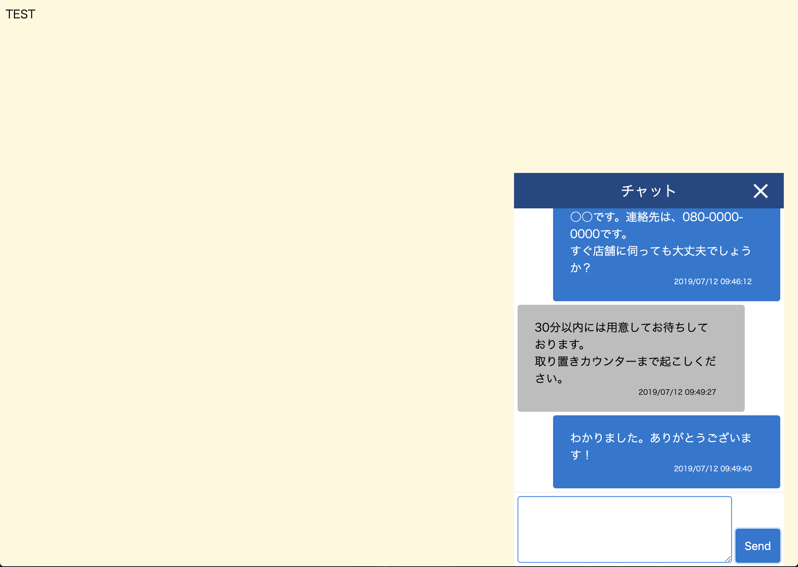

# Simple Chat System

Vue.js + Typescript + MySQL を使用したシンプルなチャットサービスです。

## screenshots





## Installation

```bash
cp .env.sample .env
docker-compose build
docker-compose run api npm run setup
docker-compose up
```

クライアント画面:  
http://localhost:3011

オペレータ画面:  
http://localhost:3012

オペレータのデフォルトログイン情報:  
LoginID: admin, Password: password 

変更する場合、 `docker-compose run api npm run setup`  
を実行する前に、  
`.env` ファイルの `OPERATOR_LOGIN_ID`, `OPERATOR_PASSWORD`を変更してください。

オペレータを追加する場合、以下コマンドを実行してください:

```bash
docker-compose run api npm run operator:create <name> <login id> <password>
```

### for Developer
開発環境を立ち上げる場合は以下。

```bash
cp .env.sample .env
cp docker-compose.override.yaml.sample docker-compose.override.yaml
docker-compose build
docker-compose run api npm run setup
docker-compose run operator npm run setup
docker-compose run client npm run setup
docker-compose up
```
